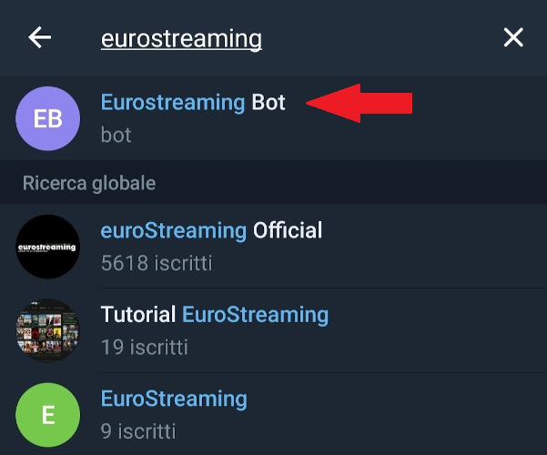

# Eurostreaming Bot Telegram

#### A Telegram Bot to follow your preferred shows episodes uploaded on the [Eurostreaming Site](https://eurostreaming.pink)

made with :heart: using Kotlin

### WHY
The project started as a hobby project to try some funny technologies like Kotlin, Exposed and Koin, plus I really like automation, so here we are.

### USAGE

You can find the bot with the name **Eurostreaming bot**.

    

Just run the bot on your Telegram app and send **/follow show_name** to start following a show. You will receive a notification when a new episode of the show is online.

Available commands are:
- **/follow**: Start following a show. Actually you must type the exact show name otherwise you will receive an error.
- **/unfollow**: Stop following a show. Same rules as the /follow command.
- **/list**: Get a list of the shows you are following.

### WHAT TO EXPECT
I have a few improvements and new features in mind, e.g.:
- [x] Better welcome message with command list and a breif explanation
- [x] Better notification with styled text and a link to the show page
- [ ] Smarter search result that suggests you the right show name if available
- [ ] Summary of how the bot works under the hood
- [ ] /stop command to remove all the user data

### TECHNOLOGIES USED
- [Jsoup](https://jsoup.org/)
- [Exposed](https://github.com/JetBrains/Exposed)
- [Jackson](https://github.com/FasterXML/jackson)
- [Koin](https://jsoup.org/)
- [Java-telegram-bot](https://github.com/pengrad/java-telegram-bot-api)

### WHY THE BOT SPEAKS ITALIAN
The streaming site is Italian and share shows with Italian language, so I think it's obvious that the bot will only have italian users.

